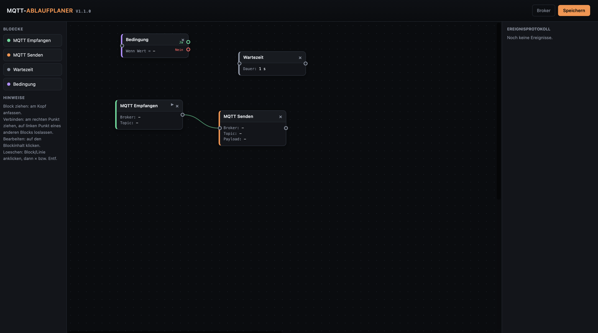

# MQTT-Ablauf- und Verschaltungsplaner



Ein lokal laufendes Web-Tool, um MQTT-gestuetzte Automatisierungen als
Blockschaltbild zu entwerfen - Bloecke werden per Klick auf die
Zeichenflaeche gelegt, per Drag & Drop positioniert und durch Linien zu
einem Ablauf verschaltet (aehnlich Node-RED).

**Aktuelle Version: v1.1.0**

## Bloecke

| Block             | Bedeutung |
|-------------------|-----------|
| **MQTT Empfangen** | Ereignis/Trigger: abonniert ein Topic bei einem Broker, startet den Ablauf bei ankommender Nachricht (optional nur bei exakt passender Payload). |
| **MQTT Senden**     | Aktion: veroeffentlicht eine Nachricht auf einem Topic. `{payload}` im Text wird durch die zuletzt empfangene Nachricht des ausloesenden Ereignisses ersetzt. |
| **Wartezeit**       | Pausiert den Ablauf fuer eine einstellbare Dauer (Sekunden). |
| **Bedingung**       | Vergleicht die zuletzt empfangene Nachricht mit einem Wert (`=`, `≠`, "enthaelt", `>`, `<`) und verzweigt nach "Ja"/"Nein". |

Bedienung:
- **Block platzieren:** links in der Palette anklicken.
- **Verschieben:** am Blockkopf ziehen.
- **Verbinden:** am rechten Punkt (Ausgang) ziehen und auf dem linken
  Punkt (Eingang) eines anderen Blocks loslassen.
- **Bearbeiten:** auf den Blockinhalt klicken.
- **Loeschen:** Block oder Linie anklicken, dann auf `×` bzw. Entf-Taste.
- **Testen:** ein "MQTT Empfangen"-Block hat einen kleinen ▶-Knopf, der
  ein Ereignis simuliert, ohne auf eine echte Nachricht zu warten; ein
  "MQTT Senden"-Block hat im Bearbeiten-Dialog einen "Jetzt senden
  (Test)"-Knopf.

Alle Broker, Bloecke und Verbindungen werden lesbar in `config.json`
gespeichert (liegt neben dem Skript bzw. der exe/App) und koennen bei
Bedarf auch von Hand angepasst werden.

## Lokal starten (Entwicklung)

```bash
pip install -r requirements.txt
python app.py
```

Danach im Browser: `http://127.0.0.1:8020` (im lokalen Netz erreichbar
ueber die IP des Rechners).

## Als GitHub-Repo einrichten

```bash
git init
git add .
git commit -m "Initial commit: MQTT-Ablaufplaner v1.0.0"
git branch -M main
git remote add origin <URL-DEINES-LEEREN-REPOS>
git push -u origin main
```

Der Workflow unter `.github/workflows/build.yml` startet danach
automatisch bei jedem Push auf `main` (und kann zusaetzlich manuell im
Tab "Actions" ueber "Run workflow" ausgeloest werden) und baut:

- eine **Windows-EXE** (`MQTT-Ablaufplaner-vX.Y.Z-windows.exe`) - startet
  immer mit sichtbarem Konsolenfenster.
- ein **macOS-Paket fuer Apple Silicon** (`MQTT-Ablaufplaner-vX.Y.Z-macos-arm64.zip`,
  gebaut nativ auf einem `macos-14`-Runner mit `--target-arch arm64`),
  bestehend aus der Programmdatei `MQTT-Ablaufplaner` und einem
  Start-Skript `Start-MQTT-Ablaufplaner.command`.

Beide Dateien findest du danach im jeweiligen Workflow-Lauf unter
"Artifacts".

### Programm starten/beenden

Das Programm startet bewusst immer mit einem sichtbaren
Terminal-/Konsolenfenster, in dem der Serverstatus zu sehen ist - so
laesst es sich jederzeit einfach wieder beenden:

- **Windows:** `MQTT-Ablaufplaner-....exe` doppelklicken - es oeffnet
  sich ein Konsolenfenster. Zum Beenden das Fenster schliessen oder
  darin STRG+C druecken.
- **macOS:** die Datei `Start-MQTT-Ablaufplaner.command` doppelklicken
  (nicht die Programmdatei `MQTT-Ablaufplaner` selbst) - der Finder
  oeffnet dafuer automatisch ein Terminal-Fenster. Zum Beenden das
  Terminal-Fenster schliessen (mit "Beenden" bestaetigen) oder STRG+C
  druecken. Beide Dateien muessen dabei im selben Ordner liegen.

### Ein Release mit fertigen Downloads erzeugen

Sobald du einen Tag im Format `vX.Y.Z` push, erstellt der Workflow
zusaetzlich automatisch ein GitHub-Release mit beiden Dateien im Anhang:

```bash
git tag v1.0.0
git push origin v1.0.0
```

Wichtig: Die Versionsnummer im Tag sollte zu `APP_VERSION` in `app.py`
passen (Zeile ganz oben in der Datei) - der Workflow liest die Version
per Regex direkt aus dieser Konstante fuer die Dateinamen und den
Release-Titel aus.

### Hinweis zu unsignierten Dateien

Die gebauten Dateien sind nicht signiert/notarisiert:
- **Windows** zeigt beim ersten Start ggf. eine SmartScreen-Warnung
  ("Weitere Informationen" -> "Trotzdem ausfuehren").
- **macOS** kann die Programmdatei beim ersten Start als "nicht
  verifizierter Entwickler" blockieren. Falls das passiert: im Finder
  mit Rechtsklick auf `MQTT-Ablaufplaner` -> "Oeffnen" bestaetigen
  (nur einmalig noetig), oder im Terminal im entpackten Ordner
  `xattr -cr .` ausfuehren, um das Quarantaene-Flag zu entfernen.

## Bei jeder Aenderung

1. `APP_VERSION` in `app.py` erhoehen (Semantic Versioning: PATCH fuer
   Bugfixes, MINOR fuer neue, abwaertskompatible Funktionen, MAJOR fuer
   Breaking Changes am Config-Format).
2. Aenderung committen, pushen.
3. Optional: passenden Tag `vX.Y.Z` push, um automatisch ein Release
   mit den gebauten Dateien zu erzeugen.
